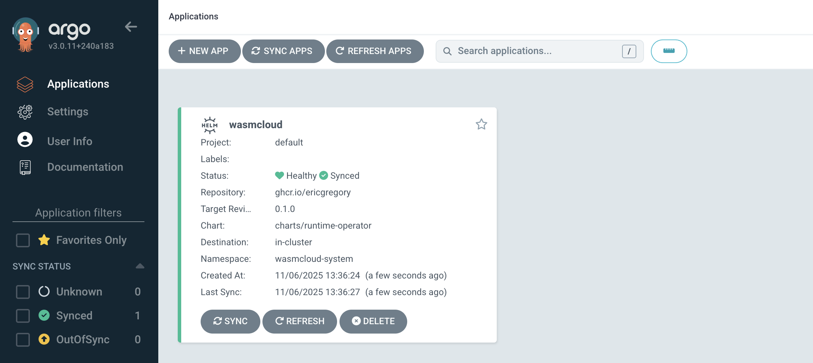
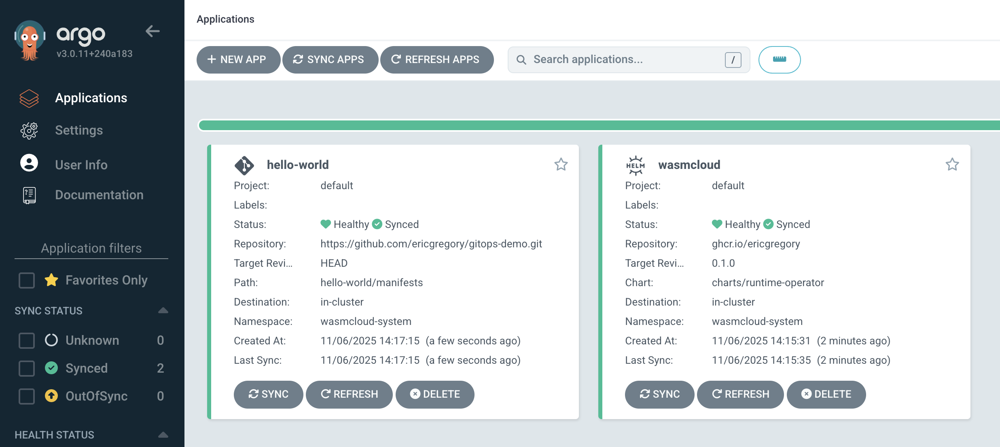
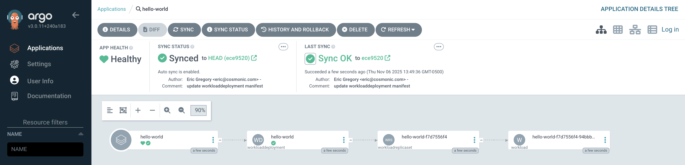
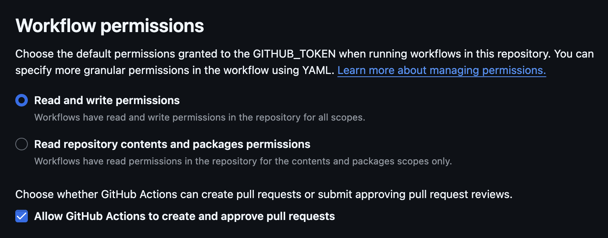
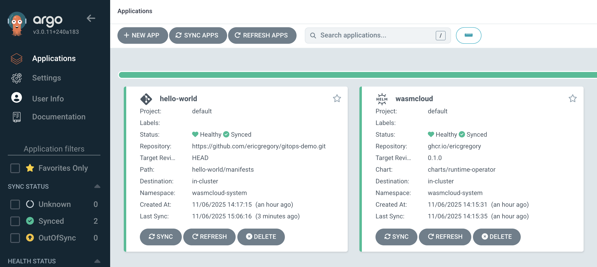

## Wasm x GitOps: WebAssembly components with Argo and Helm (Demo)

This repository includes materials for a demonstration of GitOps patterns with WebAssembly components using wasmCloud and Argo CD, presented at KubeCon + CloudNativeCon North America 2025 in Atlanta. You can follow the complete demo from this README. 

## Contents

The directory includes the following files and directories:

- `/hello-world/`: A simple `hello-world` WebAssembly component in Rust
- `hello-proj.yaml`: An Argo CD Application CRD for the `hello-world` component
- `wasmcloud-proj.yaml`: An Argo CD Application CRD for wasmCloud infrastructure
- `.github/workflows/hello-world.yml`: A GitHub Workflow that is triggered on release. This workflow uses the [`setup-wash` GitHub Action](https://github.com/wasmCloud/setup-wash-action) to build the component and push an OCI artifact to GHCR. The workflow should work in your own fork and can be adapted for other Rust-based Wasm components with minimal changes.

## Demo

You will need the following tools for this demo:

- [`kind`](https://kind.sigs.k8s.io/)
- [`kubectl`](https://kubernetes.io/releases/download/)
- [Helm](https://helm.sh/docs) v3.8.0+
- [GitHub account](https://github.com/signup)

For the best local Kubernetes experience, install `kind` and start a cluster with the following `kind-config.yaml` configuration:

```yaml
kind: Cluster
apiVersion: kind.x-k8s.io/v1alpha4
nodes:
  - role: control-plane
    extraPortMappings:
      - containerPort: 30950
        hostPort: 80
        protocol: TCP
```

The following command downloads the `kind-config.yaml` from the [wasmCloud runtime operator repository](https://github.com/wasmCloud/runtime-operator/blob/main/kind-config.yaml), starts a cluster, and deletes the config upon completion:

```shell
curl -fLO https://raw.githubusercontent.com/wasmCloud/runtime-operator/refs/heads/main/kind-config.yaml && kind create cluster --config=kind-config.yaml && rm kind-config.yaml
```

You can deploy a simple example installation of Argo CD using the [community-maintained Helm chart](https://argoproj.github.io/argo-helm/):

```shell
helm install argocd oci://ghcr.io/argoproj/argo-helm/argo-cd --set-string configs.params."server\.disable\.auth"=true --version 8.1.3 --create-namespace -n argocd
```

Port-forward the Argo CD UI:

```shell
kubectl port-forward service/argocd-server -n argocd 3000:443
```

You should see the Argo CD dashboard at [localhost:3000](localhost:3000). At the moment, there won't be any running Argo CD Applications, the high-level abstraction used by Argo CD for managed deployments.

## Deploy wasmCloud via Argo CD

Use the following Argo Application CRD manifest in a file called `wasmcloud-proj.yaml` to define your deployment of the wasmCloud runtime operator.

```yaml
apiVersion: argoproj.io/v1alpha1
kind: Application
metadata:
  name: wasmcloud
  namespace: argocd
spec:
  project: default
  source:
    chart: charts/runtime-operator
    repoURL: ghcr.io/ericgregory
    targetRevision: 0.1.0
    helm:
      values: |
        runtime:
          image:
            repository: cosmonic-labs/wash-host
            tag: "canary"
          hostGroups:
            - name: public-ingress
              replicas: 1
              service:
                type: NodePort
              http:
                enabled: true
                port: 80
                nodePort: 30950
              resources:
                requests:
                  memory: "64Mi"
                  cpu: "250m" # 0.25 CPU cores
                limits:
                  memory: "512Mi"
                  cpu: "500m" # 0.5 CPU cores
            - name: private-ingress
              replicas: 1
              service:
                type: ClusterIP
              http:
                enabled: true
                port: 80
              resources:
                requests:
                  memory: "64Mi"
                  cpu: "250m" # 0.25 CPU cores
                limits:
                  memory: "512Mi"
                  cpu: "500m" # 0.5 CPU cores
            - name: default
              replicas: 1
              resources:
                requests:
                  memory: "64Mi"
                  cpu: "250m" # 0.25 CPU cores
                limits:
                  memory: "512Mi"
                  cpu: "500m" # 0.5 CPU cores
  destination:
    name: 'in-cluster'
    namespace: wasmcloud-system
  syncPolicy:
    automated: {}
    syncOptions:
      - CreateNamespace=true
    retry:
      limit: -1
      backoff:
        duration: 30s
        factor: 2
        maxDuration: 5m
```

Along with the runtime operator itself, the Helm chart will install: 

* **Custom resource definitions (CRDs)** for wasmCloud infrastructure and Wasm workloads.
* [**NATS**](https://docs.nats.io/), a CNCF project that provides a connectivity layer between wasmCloud hosts. (NATS can also be installed separately, if you wish.)
* **Three wasmCloud hosts**

If you prefer to apply manifests via the Argo CD UI rather than `kubectl`, click "Create application" and "Edit as YAML." Replace the template with the manifest above and click "Save" and "Create."

Otherwise, apply the manifest with `kubectl`:

```shell
kubectl apply -f wasmcloud-proj.yaml
```

The Application will appear on the Argo CD dashboard. It may take a moment for the Application to finish syncing.



## Fork the demo repository

Create a fork of this repository on GitHub. (These instructions assume that you use the name `gitops-demo` for your fork&mdash;if you change the name, remember to adjust the commands accordingly.)

You can clone the forked repository locally or work entirely in the browser. The only difference is that you'll need to copy and paste an Argo CD Application CRD manifest if you work in the browser.

If you decide to clone the repo:

```shell
git clone https://github.com/<your-github-namespace>/gitops-demo.git
```

```shell
cd gitops-demo
```

## Deploy a Wasm workload

At the root of this repository is an Argo Application CRD manifest called `hello-proj.yaml` that defines a deployment of a simple "Hello world!" Wasm workload:

```yaml
apiVersion: argoproj.io/v1alpha1
kind: Application
metadata:
  name: hello-world
  namespace: argocd
spec:
  project: default
  source:
    repoURL: https://github.com/ericgregory/gitops-demo.git
    targetRevision: HEAD
    path: hello-world/manifests
  destination:
    name: "in-cluster"
    namespace: wasmcloud-system
  syncPolicy:
    automated: {}
    retry:
      limit: -1
      backoff:
        duration: 30s
        factor: 2
        maxDuration: 5m
```

Modify `hello-proj.yaml` to update the `repoURL` on Line 9 to target your new fork of the `gitops-demo` repo:

```diff
+ repoURL: https://github.com/<your-github-namespace>/gitops-demo.git
- repoURL: https://github.com/ericgregory/gitops-demo.git
```

The Argo Application is now targeting a WorkloadDeployment CRD manifest file in the `hello-world/manifests` directory of your `gitops-demo` fork.

Let's take a quick look at the WorkloadDeployment CRD manifest:

```yaml
apiVersion: runtime.wasmcloud.dev/v1alpha1
kind: WorkloadDeployment
metadata:
  name: hello-world
spec:
  replicas: 1
  template:
    spec:
      hostSelector:
        hostgroup: public-ingress
      components:
        - name: hello-world
          image: ghcr.io/ericgregory/gitops-demo:1.0.0
      hostInterfaces:
        - namespace: wasi
          package: http
          interfaces:
            - incoming-handler
          config:
            host: localhost
```

Don't make any changes at this stage, but note the OCI artifact we're using on Line 12: it's in my namespace and tagged `3.0.2`.

Now apply the `hello-proj.yaml` Argo Application CRD manifest from your `gitops-demo` repo:

```shell
kubectl apply -f hello-proj.yaml
```

You should quickly see the hello-world Application healthy and synced in the Argo CD dashboard. The `hello-world` Application is configured to **Auto-Sync**&mdash;when Argo detects changes to the source manifest, it will roll out an update to the deployment.



You can click on an Application to view it in more detail. Try clicking on the hello-world Application to view the resources defining the Wasm workload.



We can also call the component with `curl`:

```shell
curl localhost -i
```
```text
Hello from wasmCloud!
```

## Trigger a sync

Now let's try a more in-depth GitOps workflow to trigger a Wasm component sync with a GitHub release.

### Optional: Modify the Wasm component

While not strictly necessary for the purposes of this example, at this stage you could use the GitHub web UI to edit the Rust code in `hello-world/src/lib.rs` and change the "Hello world" message, like so:

```diff
+ Ok(http::Response::new("Hello from wasmCloud!\n"))
- Ok(http::Response::new("Hello from wasmCloud and Argo CD!\n"))
```

If you decide to edit the message, commit the changes.

### Create a release

Before you start this step, check the Settings page for your repo and make sure GitHub Actions has permission to make pull requests:



Now we'll create a release in GitHub. Click "Create a new release" in the right sidebar of your gitops-demo fork's repository page, or navigate to `https://github.com/<your-github-namespace>/gitops-demo/releases/new`.

Let's call our release `3.0.3`. Create a new image tag, title the release, and click "Publish release."

Publishing the release will trigger a GitHub Workflow. (If you'd like to watch the run, you can click the "Actions" tab for the repo and select "publish" under Jobs.) This workflow will:

- Compile a Wasm binary from the Rust code in the hello-world directory using the [setup-wash GitHub Action](https://github.com/wasmCloud/setup-wash-action)
- Push the Wasm component to ghcr.io as an OCI artifact under your namespace
- Update the image tag in the component's Kubernetes manifest to reflect the version of your new release
- Commit and push the manifest update in your repo

**Note**: The first time this workflow runs in your repository, it will take several minutes to build the necessary tooling, but those tools will be cached&mdash;future runs in the repo will generally take under a minute.

In the meantime, let's take a look at the last steps of the GitHub Workflow file:

```yaml
- name: Update image tag in Kubernetes manifest
  working-directory: ./hello-world
  run: |
    DEPLOYMENT_FILE="manifests/workloaddeployment.yaml"
    OLD_IMAGE=$(grep "image:" "$DEPLOYMENT_FILE" | awk '{print $2}')
    NEW_IMAGE="ghcr.io/${{ env.GHCR_REPO_NAMESPACE }}/components/hello-world:${{ github.ref_name }}"

    # Update the image tag
    sed -i "s|image:.*|image: $NEW_IMAGE|" "$DEPLOYMENT_FILE"

- name: Create Pull Request
  uses: peter-evans/create-pull-request@v7
  with:
    token: ${{ secrets.GITHUB_TOKEN }}
    commit-message: |
      Update image tag in manifest to ${{ github.ref_name }}
    title: Update image tag in manifest to ${{ github.ref_name }}
```

After building the component from your repo, the run submits a pull request updating the image specification in the hello-world manifest that our Argo CD hello-world Application is targeting, so that the manifest specifies an 0.2.0 image in _your_ GHCR registry. This change to the manifest will trigger a sync in Argo CD.

Once the run completes successfully, merge the automated pull request, switch over to the Argo CD dashboard, and take a look at the hello-world Application. You should see that it has synced.



You can click through to see the commit that triggered the sync, or click on the Application at the left-hand side of the diagram and see the events associated with it.

### Test the deployment

In a new terminal tab:

```shell
curl localhost -i
```

```text
Hello from wasmCloud and Argo CD!
```

### Clean up

Once you're done, you can clean up your environment:

```shell
kubectl delete -f wasmcloud-proj.yaml
```
```shell
kubectl delete -f hello-proj.yaml
```
```shell
helm uninstall argocd -n argocd
```
```shell
kind delete cluster
```
